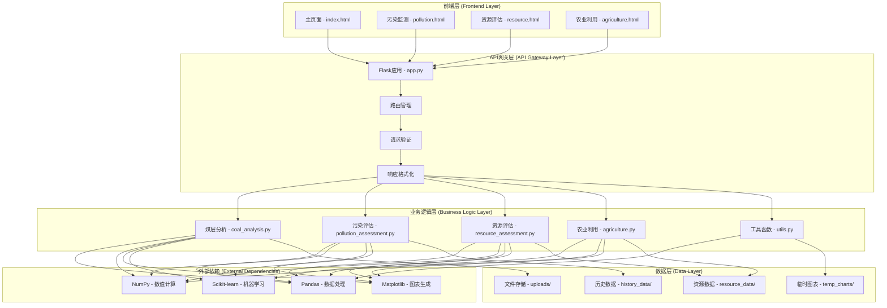
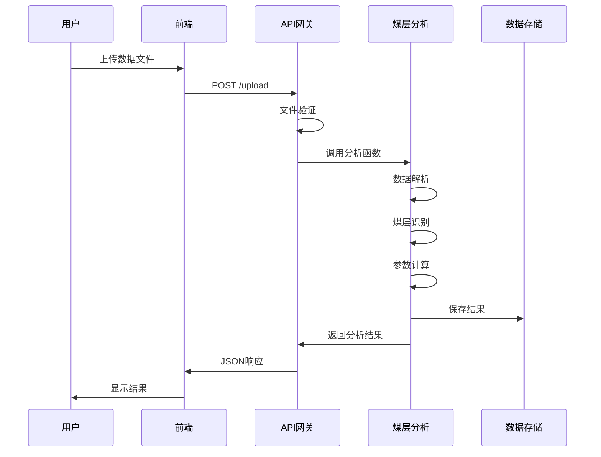

# 矿能云析系统架构设计文档

## 📋 目录

- [系统概述](#系统概述)
- [整体架构](#整体架构)
- [核心模块设计](#核心模块设计)
- [数据流设计](#数据流设计)
- [技术选型](#技术选型)
- [部署架构](#部署架构)
- [安全设计](#安全设计)
- [性能优化](#性能优化)
- [扩展性设计](#扩展性设计)

## 🎯 系统概述

矿能云析系统是一个基于Web的智能煤层分析平台，采用前后端分离的架构设计，通过RESTful API进行数据交互，提供煤层识别、污染评估、资源计算和农业利用等核心功能。

### 设计原则

- **模块化设计**: 各功能模块独立，便于维护和扩展
- **数据驱动**: 基于科学算法进行数据分析
- **用户友好**: 提供直观的Web界面和交互体验
- **高性能**: 支持大数据量处理和实时分析
- **可扩展**: 支持新功能模块的快速集成

## 🏗️ 整体架构



## 🔧 核心模块设计

### 1. 煤层分析模块 (coal_analysis.py)

**职责**: 负责煤层识别和基础数据分析

**核心功能**:
- 数据文件解析和验证
- 煤层识别算法实现
- 深度范围计算
- 物理参数分析

**关键算法**:
```python
def classify_coal_layer(data):
    """基于多参数阈值识别煤层"""
    coal_conditions = (
        (data['双侧向电阻率'] >= 50) & (data['双侧向电阻率'] <= 2000) &
        (data['声波时差'] >= 300) & (data['声波时差'] <= 600) &
        (data['自然伽玛'] >= 20) & (data['自然伽玛'] <= 80) &
        (data['密度'] >= 1.0) & (data['密度'] <= 1.8)
    )
    return coal_conditions
```

**输入**: 钻井数据DataFrame
**输出**: 煤层掩码、煤层数据、图表数据

### 2. 污染评估模块 (pollution_assessment.py)

**职责**: 评估煤层污染程度和环境影响

**核心功能**:
- 污染指数计算
- 污染物类型识别
- 扩散风险分析
- 影响评估

**评估模型**:
```python
def assess_coal_pollution(data, coal_mask):
    """多参数污染评估模型"""
    # 深度分段分析
    # 物理参数加权计算
    # 污染等级分类
    # 扩散风险评估
```

**输出**: 污染评估报告、可视化图表

### 3. 资源评估模块 (resource_assessment.py)

**职责**: 计算煤炭资源储量和制定开采规划

**核心功能**:
- 资源储量计算
- 煤层品质评估
- 开采难度分析
- 开采方法推荐
- 开采规划优化

**计算模型**:
```python
def calculate_coal_resources(data, coal_mask, area):
    """资源储量计算模型"""
    # 体积计算
    # 质量计算
    # 品质评估
    # 开采难度评估
```

**输出**: 资源评估报告、开采规划、趋势预测

### 4. 农业利用模块 (agriculture.py)

**职责**: 提供土地复垦和农业利用建议

**核心功能**:
- 土壤质量分析
- 复垦方案制定
- 作物种植建议
- 管理措施推荐

**分析模型**:
```python
def assess_soil_quality(data, coal_mask):
    """土壤质量综合评估"""
    # 物理参数分析
    # 化学性质评估
    # 肥力评分
    # 污染程度评估
```

**输出**: 土壤分析报告、复垦方案、种植建议

### 5. 工具模块 (utils.py)

**职责**: 提供通用工具函数

**核心功能**:
- 文件类型验证
- 中文字体设置
- 图表转换
- 数据格式化

## 📊 数据流设计

### 数据输入流程



### 数据存储结构

```
uploads/                    # 上传文件存储
├── *.xlsx                 # 原始数据文件
└── *.csv                  # CSV格式文件

history_data/              # 历史数据存储
├── {location}_{timestamp}.json  # 污染评估历史
└── {location}_{timestamp}.json  # 其他评估历史

resource_data/             # 资源数据存储
├── {location}_{timestamp}.json  # 资源评估数据
└── agri_{location}_{timestamp}.json  # 农业评估数据

temp_charts/               # 临时图表存储
├── *.png                 # 生成的图表文件
└── *.jpg                 # 其他图像文件
```

## 🛠️ 技术选型

### 后端技术栈

| 技术 | 版本 | 用途 | 选择理由 |
|------|------|------|----------|
| Python | 3.8+ | 主要开发语言 | 丰富的科学计算库 |
| Flask | 2.0.1 | Web框架 | 轻量级，易于扩展 |
| Pandas | 1.3.3 | 数据处理 | 强大的数据分析能力 |
| NumPy | 1.21.2 | 数值计算 | 高效的数组运算 |
| Matplotlib | 3.4.3 | 图表生成 | 专业的科学绘图 |
| Scikit-learn | 1.0 | 机器学习 | 丰富的算法库 |
| SciPy | 1.7.1 | 科学计算 | 高级数学函数 |

### 前端技术栈

| 技术 | 版本 | 用途 | 选择理由 |
|------|------|------|----------|
| HTML5 | - | 页面结构 | 语义化标签 |
| CSS3 | - | 样式设计 | 现代CSS特性 |
| Bootstrap | 5.2.3 | UI框架 | 响应式设计 |
| Chart.js | 3.x | 图表库 | 交互式图表 |
| JavaScript | ES6+ | 交互逻辑 | 现代JS特性 |
| NoUiSlider | 14.6.3 | 滑块组件 | 精确范围选择 |

### 开发工具

| 工具 | 用途 | 配置 |
|------|------|------|
| Git | 版本控制 | 分布式管理 |
| VS Code | 代码编辑 | Python扩展 |
| Postman | API测试 | 接口调试 |
| Chrome DevTools | 前端调试 | 性能分析 |

## 🚀 部署架构

### 开发环境

```yaml
环境配置:
  操作系统: Windows 10/11, Ubuntu 20.04+, macOS 12+
  Python版本: 3.8+
  内存要求: 4GB+
  存储空间: 2GB+
  
服务配置:
  Flask应用: 单进程开发模式
  端口: 5000
  调试模式: 启用
  热重载: 启用
```

### 生产环境

```yaml
Web服务器: Nginx + Gunicorn
应用服务器: Gunicorn (多进程)
数据库: 可选MySQL/PostgreSQL
缓存: Redis (可选)
文件存储: 本地存储/NFS
监控: 日志文件 + 系统监控
```

### Docker部署 (推荐)

```dockerfile
# Dockerfile
FROM python:3.9-slim

WORKDIR /app
COPY requirements.txt .
RUN pip install -r requirements.txt

COPY . .
EXPOSE 5000

CMD ["gunicorn", "--bind", "0.0.0.0:5000", "app:app"]
```

```yaml
# docker-compose.yml
version: '3.8'
services:
  web:
    build: .
    ports:
      - "5000:5000"
    volumes:
      - ./uploads:/app/uploads
      - ./history_data:/app/history_data
      - ./resource_data:/app/resource_data
    environment:
      - FLASK_ENV=production
```

## 🔒 安全设计

### 输入验证

```python
# 文件类型验证
def allowed_file(filename):
    return '.' in filename and \
           filename.rsplit('.', 1)[1].lower() in ALLOWED_EXTENSIONS

# 文件大小限制
app.config['MAX_CONTENT_LENGTH'] = 16 * 1024 * 1024  # 16MB
```

### 数据安全

- **文件上传**: 限制文件类型和大小
- **路径安全**: 使用`secure_filename`防止路径遍历
- **数据验证**: 严格验证输入参数
- **错误处理**: 避免敏感信息泄露

### 访问控制

```python
# CORS配置
CORS(app, origins=['http://localhost:3000'])

# 请求限制
from flask_limiter import Limiter
limiter = Limiter(app, key_func=get_remote_address)
```

## ⚡ 性能优化

### 数据处理优化

```python
# 使用NumPy向量化操作
def process_data_vectorized(data):
    return np.where(conditions, values, default_values)

# 数据缓存
@lru_cache(maxsize=128)
def expensive_calculation(params):
    return result
```

### 图表生成优化

```python
# 非交互式后端
matplotlib.use('Agg')

# 图表缓存
def generate_chart_with_cache(data):
    cache_key = hashlib.md5(str(data).encode()).hexdigest()
    if cache_key in chart_cache:
        return chart_cache[cache_key]
    # 生成图表...
```

### 前端优化

- **资源压缩**: 使用CDN和压缩
- **懒加载**: 按需加载图表组件
- **缓存策略**: 浏览器缓存静态资源
- **代码分割**: 按页面分割JavaScript

## 🔄 扩展性设计

### 模块化架构

```python
# 插件式模块设计
class AnalysisModule:
    def __init__(self, name, version):
        self.name = name
        self.version = version
    
    def process(self, data):
        raise NotImplementedError
    
    def validate(self, data):
        raise NotImplementedError

# 模块注册机制
class ModuleRegistry:
    def __init__(self):
        self.modules = {}
    
    def register(self, module):
        self.modules[module.name] = module
    
    def get_module(self, name):
        return self.modules.get(name)
```

### API扩展

```python
# RESTful API设计
@app.route('/api/v1/analysis/<analysis_type>', methods=['POST'])
def analyze_data(analysis_type):
    module = module_registry.get_module(analysis_type)
    if not module:
        return jsonify({'error': 'Analysis type not supported'}), 400
    
    result = module.process(request.json)
    return jsonify(result)
```

### 数据库集成

```python
# 数据库抽象层
class DatabaseManager:
    def __init__(self, db_type='sqlite'):
        self.db_type = db_type
        self.connection = self._create_connection()
    
    def save_analysis_result(self, result):
        # 保存分析结果到数据库
        pass
    
    def get_analysis_history(self, location):
        # 获取历史分析数据
        pass
```

## 📈 监控和日志

### 日志系统

```python
import logging

# 配置日志
logging.basicConfig(
    level=logging.INFO,
    format='%(asctime)s - %(name)s - %(levelname)s - %(message)s',
    handlers=[
        logging.FileHandler('coal_app.log'),
        logging.StreamHandler()
    ]
)

logger = logging.getLogger('coal_analysis')
```

### 性能监控

```python
# 请求时间监控
import time
from functools import wraps

def monitor_performance(func):
    @wraps(func)
    def wrapper(*args, **kwargs):
        start_time = time.time()
        result = func(*args, **kwargs)
        end_time = time.time()
        logger.info(f"{func.__name__} took {end_time - start_time:.2f} seconds")
        return result
    return wrapper
```

## 🔮 未来规划

### 短期目标 (3-6个月)

- [ ] 添加用户认证系统
- [ ] 实现数据导入导出功能
- [ ] 优化移动端显示
- [ ] 添加更多图表类型

### 中期目标 (6-12个月)

- [ ] 集成机器学习模型
- [ ] 添加实时数据流处理
- [ ] 实现多用户协作
- [ ] 开发移动应用

### 长期目标 (1-2年)

- [ ] 构建微服务架构
- [ ] 集成大数据处理平台
- [ ] 开发AI辅助决策系统
- [ ] 建立行业标准接口

---

**架构设计原则**: 模块化、可扩展、高性能、易维护

**技术债务管理**: 定期重构、代码审查、文档更新

**持续改进**: 用户反馈、性能监控、技术升级
