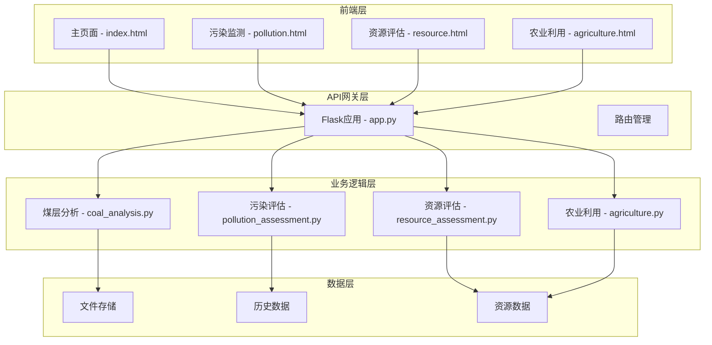

# 矿能云析系统 - 智能煤层分析平台

<p align="center">
  
  
  
  
</p>

## 📋 项目简介

矿能云析系统是一个基于Web的智能煤层分析平台，采用前后端分离的架构设计，通过RESTful API进行数据交互。系统提供煤层识别、污染评估、资源计算和农业利用等核心功能，帮助矿业企业和研究机构进行智能化数据分析和决策支持。

### 核心功能

- **煤层智能识别**: 基于多参数阈值算法自动识别煤层位置和厚度
- **污染监测评估**: 评估煤层污染程度和环境影响
- **资源储量计算**: 精确计算煤炭资源储量和制定开采规划
- **农业利用建议**: 提供土地复垦和农业利用方案
- **数据可视化**: 丰富的图表展示和交互式深度控制
- **历史数据管理**: 完整的历史记录和趋势分析

## 🎯 快速开始

### 系统要求

- **Python**: 3.8+
- **操作系统**: Windows 10/11, Ubuntu 20.04+, macOS 12+
- **内存**: 4GB+ (推荐8GB+)
- **存储**: 2GB+ 可用空间

### 安装步骤

```bash
# 1. 克隆项目
git clone <repository-url>
cd python_project

# 2. 安装依赖
pip install -r requirements

# 3. 启动系统
python run.py
```

### Docker部署

```bash
# 使用Docker Compose启动所有服务
docker-compose up -d
```

### 访问系统

启动成功后，打开浏览器访问：
- **主页面**: http://localhost:5000
- **API接口**: http://localhost:5000/api/v1/health

## 🏗️ 系统架构



## 📁 项目结构

```
python_project/
├── config/                     # 配置文件目录
│   └── settings.py            # 系统配置文件
├── data/                      # 数据存储目录
│   ├── uploads/               # 上传文件存储
│   ├── history/               # 历史数据存储
│   ├── resource/              # 资源数据存储
│   └── charts/                # 图表文件存储
├── docs/                      # 文档目录
├── logs/                      # 日志文件目录
├── src/                       # 源代码目录
│   ├── core/                  # 核心业务逻辑
│   ├── api/                   # API接口模块
│   ├── models/                # 数据模型
│   ├── templates/             # 页面模板
│   └── tests/                 # 测试代码
├── app.py                     # 主应用程序入口
├── run.py                     # 启动脚本
├── requirements               # 项目依赖列表
├── Dockerfile                 # Docker配置文件
└── docker-compose.yml         # Docker Compose配置
```

## 🔧 核心模块

### 1. 煤层分析模块

负责煤层识别和基础数据分析，使用多参数阈值算法识别煤层位置和厚度。

### 2. 污染评估模块

评估煤层污染程度和环境影响，提供污染等级分类和扩散风险分析。

### 3. 资源评估模块

计算煤炭资源储量和制定开采规划，支持开采难度分析和方法推荐。

### 4. 农业利用模块

提供土地复垦和农业利用建议，评估土壤质量和作物种植适宜性。

## 🚀 技术栈

### 后端技术

| 技术 | 用途 |
|------|------|
| Python 3.8+ | 主要开发语言 |
| Flask 2.0.1 | Web框架 |
| Pandas 1.3.3 | 数据处理 |
| NumPy 1.21.2 | 数值计算 |
| Matplotlib 3.4.3 | 图表生成 |
| Scikit-learn 1.0 | 机器学习 |

### 前端技术

| 技术 | 用途 |
|------|------|
| HTML5/CSS3 | 页面结构和样式 |
| Bootstrap 5.2.3 | UI框架 |
| Chart.js 3.x | 图表库 |
| JavaScript ES6+ | 交互逻辑 |
| NoUiSlider 14.6.3 | 滑块组件 |

## 📊 API接口

### 文件上传
```
POST /upload
Content-Type: multipart/form-data
```

### 数据获取
```
GET /data/<filename>?start=<start_depth>&end=<end_depth>
```

### 污染评估
```
POST /pollution-assessment
Content-Type: multipart/form-data
```

### 资源评估
```
POST /resource-assessment
Content-Type: multipart/form-data
```

### 农业评估
```
POST /agriculture-assessment
Content-Type: multipart/form-data
```

## 🛠️ 配置说明

### 环境配置

系统支持三种环境：
- **开发环境**: `python run.py --env development`
- **生产环境**: `python run.py --env production`
- **测试环境**: `python run.py --env testing`

### 端口配置

```bash
# 自定义端口
python run.py --port 8080

# 自定义主机和端口
python run.py --host 127.0.0.1 --port 8080
```

## 🐛 故障排除

### 常见问题

1. **端口被占用**
   ```bash
   # 查看端口占用
   netstat -ano | findstr :5000
   
   # 使用其他端口
   python run.py --port 8080
   ```

2. **依赖安装失败**
   ```bash
   # 升级pip
   python -m pip install --upgrade pip
   
   # 重新安装依赖
   pip install -r requirements --force-reinstall
   ```

## 📈 性能优化

- 使用NumPy向量化操作提升数据处理速度
- 实现图表缓存机制减少重复生成
- 采用非交互式后端避免服务器环境渲染问题
- 前端资源压缩和懒加载优化

## 🔒 安全设计

- 文件类型和大小验证
- 路径安全防护防止路径遍历
- CORS跨域请求配置
- 请求频率限制

## 🔄 扩展性设计

- 模块化架构便于功能扩展
- 插件式模块设计支持新功能快速集成
- RESTful API设计便于外部系统集成
- 数据库抽象层支持多种数据库

## 📞 技术支持

- **文档**: 查看 [docs/](docs/) 目录
- **架构**: 查看 [ARCHITECTURE.md](ARCHITECTURE.md)
- **项目结构**: 查看 [PROJECT_STRUCTURE.md](PROJECT_STRUCTURE.md)
- **快速启动**: 查看 [QUICK_START.md](QUICK_START.md)

## 📄 许可证

本项目采用MIT许可证，详情请见 [LICENSE](LICENSE) 文件。

## 👥 贡献者

- 矿能云析开发团队

## 🔄 更新日志

### v1.0.0
- 初始版本发布
- 实现煤层识别、污染评估、资源计算和农业利用四大核心功能
- 完成Web界面和API接口开发
- 支持Docker部署

---

**矿能云析系统** - 让数据驱动决策，让智能赋能矿业 🌟